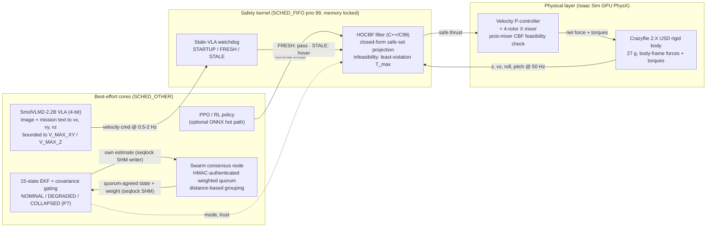
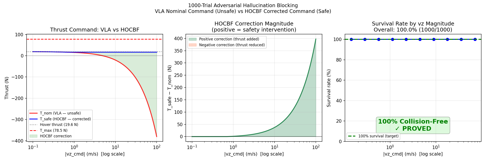
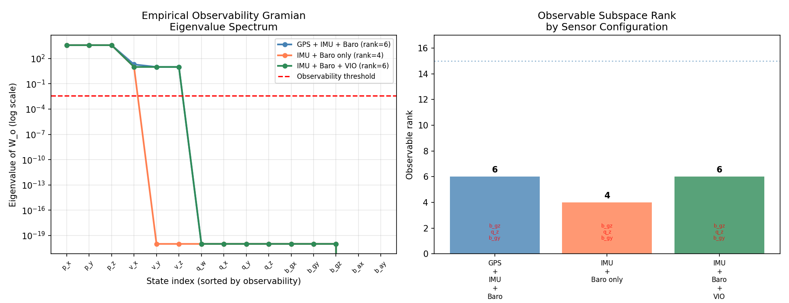
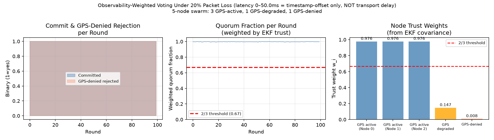

# Autonomous Drone Safety Architecture

[](https://github.com/Rhutvik-pachghare1999/autonomous-drone-safety-architecture/actions)
[](LICENSE)
[](https://www.python.org/)
[](https://rhutvik-pachghare1999.github.io/autonomous-drone-safety-architecture/)

A safety architecture for autonomous multirotors: every command an AI model
or RL policy issues is projected through a closed-form control-barrier-function
(HOCBF) filter before it can reach the motors. Around that kernel sit a
15-state EKF covariance-gating ladder, an HMAC-authenticated
observability-weighted swarm consensus protocol, and a bounded-latency
real-time execution path (SCHED_FIFO userspace on Linux, 2,725 ns measured
filter WCET over 100,000 cycles — a soft real-time budget enforced by O(1)
arithmetic, not a formal deadline guarantee).

The vehicle under test is the real 27 g Crazyflie 2.X USD model in NVIDIA
Isaac Sim GPU PhysX; the command sources are a SmolVLM2-2.2B vision-language
model and a PPO policy. This is a research prototype used to study how
deterministic safety filters bound learned-model behavior in real time.
It is not a certified flight controller.

**At a glance** (every number below is regenerated from a committed artifact)

| Result | Value | Artifact |
|---|---|---|
| Isolation A/B, 500 paired episodes | filter OFF 0% survival, filter ON 100% | `experiments/results/crazyflie_vla_iso500.json` |
| HOCBF filter WCET (SCHED_FIFO, 100k trials) | 2,725 ns (p99 = 31 ns) | `experiments/results/latency_raw.csv`, `wcet_evt.json` |
| EVT tail bound, P = 10⁻⁹ (Gumbel) | 1,733 ns vs 100 µs deadline | `experiments/results/wcet_evt.json` |
| Adversarial command sweep, 1,000 cases | 100% survival | `experiments/results/hallucination_1000.json` |
| End-to-end swarm flight (GPS denied at t = 2 s) | error bounded 0.192 m vs 0.880 m ego-only | `experiments/results/consensus_ekf_flight.json` |
| Live rendered-camera VLA flight, 216 queries | 100% structured parses, 0 crashes | `experiments/results/vla_realcam_summary.json` |
| Test suite | 68 pytest tests + C watchdog test, CI green | `tests/`, `tests/watchdog_test.c` |

---

## Headline result: isolation A/B on the real Crazyflie 2.X

SmolVLM2-2.2B (4-bit) pilots NVIDIA's 27 g Crazyflie 2.X USD asset on GPU
PhysX; the HOCBF filter (mass 0.027 kg, T_max 0.60 N) sits between the model
and the rotors. Both arms of the experiment fly the identical controller
(`CrazyflieController.compute_wrench`, same velocity-P + attitude-PD gains,
same attitude moments through the same mixer). The only difference is whether
the nominal collective thrust passes through the safe-set projection
(`filter_thrust`) before mixing.

Across 500 paired, domain-randomized episodes (start altitude, dive velocity,
onset, wind, command delay) under worst-case scripted adversarial dives:

**Filter OFF crashes 500/500 (0% survival, Wilson 95% CI [0.0, 0.8], mean
min-altitude 0.019 m). Filter ON survives 500/500 (100% survival, CI
[99.2, 100.0], mean min-altitude 0.803 m, 73.8% of steps filtered).**


Because controller, gains, attitude correction, and randomization are
byte-identical across arms, the survival difference is attributable to the
safety-filter projection alone. Generated by
`experiments/plot_crazyflie_ab_large.py` from
`experiments/results/crazyflie_vla_iso500.json` (Slurm job 63859934 on an
ASU Sol A100; run script `sim/hocbf_crazyflie_iso.py`).

Scope, stated plainly: simulation only (Isaac PhysX), not a hardware drone.
The adversarial dive is a scripted worst-case command — the 2.2B model
refused dive prompts. The A/B flies a pure-Python HOCBF port verified
identical to the C++ module across 2,450 cross-check cases (Isaac Sim 6.0.1's
kit Python cannot load the extension); the latency claim is measured
separately on the C/C99 implementation. An earlier A/B whose ON arm also
swapped the controller's nominal law and zeroed the attitude moments is kept
as history in the results table below — same direction of effect, but
confounded attribution.

---

## Architecture



Design rules enforced by the code:

- The best-effort side may be slow, lossy, or hallucinating; the RT side
  never waits on it. Stale commands degrade to hover, never to silence.
- Every cross-process handoff is a single-producer seqlock over `/dev/shm`
  (VLA commands, EKF snapshots, consensus output). Torn or uninitialized
  data is rejected; the EKF path fails closed — a node with no valid
  estimate sits the consensus round out instead of proposing fabricated
  state.
- Consensus votes are HMAC-SHA256 authenticated (cluster shared key), so
  quorum membership and vote deduplication are by authenticated identity.
  Grouping is distance-based (single-linkage, 1 cm), not hash quantization.
  This is weighted voting with authenticated membership — not Byzantine
  fault tolerance.

---

## Verified results

Each row names the committed artifact the number is regenerated from. Runs
marked Sol were executed on the ASU Sol cluster; everything else reproduces
on a desktop checkout.

| Claim | Value | Artifact | Notes |
|---|---|---|---|
| HOCBF filter WCET | 2,725 ns | `latency_raw.csv` (100,000 rows), `wcet_evt.json` | SCHED_FIFO prio 99, affinity-pinned core (pinning is not core isolation; that needs `isolcpus`). No-root fresh-clone run measures ≈ 31 ns. |
| HOCBF WCET, ASU Sol node | max 4,849 ns; p99 = p99.9 = 31 ns; EVT P = 10⁻⁹ bound 2,452 ns | `latency_raw_sol.csv`, `wcet_sol.json`, `wcet_sol.png` | 100,000 trials, AMD EPYC 7413, Slurm job 63814754, taskset-pinned. Userspace run (no SCHED_FIFO in container) — portability cross-check, not the number of record. |
| Latency distribution | mean 22.31 ns, p50 20 ns, p99 31 ns | `wcet_evt.json` | From the committed CSV. |
| EVT tail bound, P = 10⁻⁹ | 1,733 ns | `wcet_evt.json` | Gumbel block-maxima fit. |
| Adversarial command sweep | 100% survival (1,000/1,000), 90.7% of commands corrected | `hallucination_1000.json`, `hallucination_1000.png` | Commanded descent rate swept −0.1 to −100 m/s. Worst case: T_nom = −380.4 N corrected to T_safe = 16.9 N (397.25 N correction). |
| EKF observable rank, GPS denied | 6 → 4 | `observability_gramian.json` | IMU + barometer alone loses horizontal position. |
| EKF observable rank, VIO added | 4 → 6 | `observability_gramian.json` | OpenVINS-derived noise model. |
| Consensus under 20% packet loss | 100% commits (100/100 rounds), 100% GPS-denied rejection | `consensus_fault.json`, `consensus_fault.png` | Mean quorum fraction 0.997. Caveat in artifact: injected "latency" is a timestamp offset only — the test exercises loss, not network delay. |
| End-to-end flight + EKF + live consensus | swarm error bounded at 0.192 m; ego-only drifts 0.880 m; P7 correctly silent; 176 VIO covariance reductions | `consensus_ekf_flight.json` | 4 real consensus nodes over ZMQ + SHM, HMAC-authenticated, ego publishing through the production EKF SHM writer. GPS denied at t = 2 s with 0.2 m/s unmodelled drift. |
| Rendered-camera VLA flight (Phase 5, Sol A100) | 6 episodes × 36 queries: 216/216 structured parses, 0 crashes, guard filtered 33.3% of steps | `vla_realcam_summary.json`, `vla_realcam_ep0_*.png` | Onboard RTX 224×224 render → SmolVLM2-2.2B 4-bit @ 2 Hz → HOCBF → 50 Hz controller. Rendered sim camera, not a physical sensor; dive phases scripted. |
| Battery model vs NASA PCoE data | poly-4 RMSE 0.014–0.030 Ah; spec model overestimates life 4–6× | `battery_validation.json`, `battery_validation.png` | 18650 cells; the project assumes a 6S LiPo, so chemistry scaling is unvalidated. |
| ~~Crazyflie A/B, controller-substituted~~ — superseded | ~~OFF 0/500 vs ON 500/500~~ | `crazyflie_vla_ab500.json` | History only: the ON arm also replaced the nominal thrust law and zeroed attitude moments, so it measured "controller swap + CBF". Directionally consistent with the isolation run; not attribution-grade. |
| ~~Isaac SIL A/B, cuboid surrogate~~ — superseded | ~~ON 86% vs OFF 16%~~ | `isaac_sil_summary.json` | History only: 2 kg cuboid point-mass, not the real vehicle. The 14 ON-arm crashes were actuator infeasibility — a documented physical limit. |

### Filter latency on ASU Sol

100,000 trials on an AMD EPYC 7413, taskset-pinned. Left: measured latency
against the 100 µs deadline. Middle: CCDF tail with Gumbel EVT extrapolation
to P = 10⁻⁹. Right: OS scheduler jitter against the 50 µs SLA.


### Adversarial command sweep

Nominal commands from −0.1 to −100 m/s commanded descent rate versus the
filtered output. The filter clamps every infeasible command onto the safe
set; the correction grows with command severity, up to 397.25 N.



### Estimator observability

Empirical observability Gramian eigenvalue spectrum and observable rank by
sensor configuration: GPS + IMU + barometer gives rank 6; losing GPS drops
to 4 (horizontal position unobservable); adding a VIO factor restores 6.



### Consensus under packet loss

Per-round commit and GPS-denied rejection, weighted quorum fraction, and
per-node trust weights derived from EKF covariance over 100 rounds at 20%
packet loss.



---

## Live rendered-camera flight (Phase 5)

The perception loop is closed end to end: the drone's onboard RTX-rendered
camera (224×224 RGB) feeds SmolVLM2-2.2B (4-bit NF4) on a Sol A100 at 2 Hz;
every command passes the HOCBF filter before the 50 Hz controller and mixer
drive the Crazyflie rigid body. Six episodes × 36 queries = 216 live model
decisions, zero crashes, every response parsed as structured
`{"vx","vy","vz"}` JSON. Mean query latency 1,185 ms (p95 1,254 ms; max
5,812 ms is first-call warmup).

Frames from episode 0 — the same sensor feed the model saw:

| Hover | Forward |
|---|---|
|  |  |

Reproduce on Sol:

```bash
sbatch slurm/32_vla_prep6.sbatch                    # one-time dependency install
sbatch --export=ALL,N_EP=6 slurm/33_vla_realcam6.sbatch
```

Full environment notes (Isaac Sim 6.0.1 apptainer, torch injection order,
why 5.1 is not used on Sol's driver): `slurm/README_SOL.md`,
`docs/REAL_CRAZYFLIE_VLA_SIM.md`.

---

## Build, test, reproduce

Requirements for the CI-covered subset: Python 3.12, `numpy scipy casadi
pyzmq osqp pytest pybind11 hypothesis`, a C99 compiler, CMake ≥ 3.20.

```bash
# 1. Build the C++ filter and pybind11 module
mkdir -p build && cd build
cmake .. -DCMAKE_BUILD_TYPE=Release && make -j2 && make install
cd ..

# 2. Test suite — expect 68 passed
PYTHONPATH=. python3 -m pytest tests/ -q

# 3. C watchdog test + SIL replay
cd build && ctest --output-on-failure && cd ..
PYTHONPATH=. python3 -c "from src.utils.shm_bridge import VLASharedMemoryPublisher; \
    p = VLASharedMemoryPublisher(); p.publish(0.0, 0.0, 0.0)"
build/sil_runner 20 /tmp/sil.csv

# 4. Experiments that run locally
PYTHONPATH=. python3 experiments/exp_hallucination_1000.py
PYTHONPATH=. python3 experiments/exp_wcet_evt.py
PYTHONPATH=. python3 experiments/exp_observability_gramian.py
PYTHONPATH=. python3 experiments/exp_consensus_fault.py
PYTHONPATH=. python3 experiments/exp_consensus_ekf_flight.py   # ~15 s, real ZMQ + SHM
PYTHONPATH=. python3 services/consensus_node.py --test

# 5. Real-time benchmark (requires root for SCHED_FIFO + mlockall)
sudo build/safety_filter 100000 2        # 1 kHz loop, 100 us deadline;
                                         # exits non-zero on any deadline miss
```

The RT binary verifies its own setup (scheduler policy, priority, affinity)
and fails closed if any guarantee cannot be established. Latency is measured
at the end of the full cycle — SHM read, policy, HOCBF, UDP send, state
update — and any deadline miss fails the run. Without root it refuses to
start; `--require-onnx` additionally refuses to run without the policy.
Numbers from a `-DNO_ONNX` build measure the VLA-only path.

Optional paths (not covered by CI): ONNX-linked RT build, Isaac Sim closed
loops, VLA bridge (`transformers`, `torch`, `bitsandbytes`, GPU). See
`docs/DEMO_RUNBOOK.md`.

---

## Repository layout

| Path | Contents |
|---|---|
| `src/control/hocbf.cpp` | C++ HOCBF filter + pybind11 wrapper |
| `src/rt/safety_filter.c` | C99 RT filter, watchdog, ONNX path, 1 kHz benchmark |
| `src/rt/watchdog.{h,c}` | Stale-VLA state machine + seqlock snapshot reader |
| `src/estimation/ekf_gating.py` | 15-state EKF gating, P7 ladder, VIO factor, consensus reader |
| `src/estimation/ekf_shm_writer.py` | Production seqlock writer for the estimator snapshot |
| `src/perception/vla_bridge.py` | SmolVLM2 bridge, structured parse, velocity bounds |
| `services/consensus_node.py` | Authenticated observability-weighted consensus node |
| `sim/` | Isaac Sim flight loops and A/B harnesses |
| `experiments/` | Reproducible experiments; results committed under `experiments/results/` |
| `slurm/` | ASU Sol job scripts and environment notes |
| `docs/` | `WCET_BENCHMARK.md`, `LATENCY_BUDGET.md`, `ARCHITECTURE.md`, `CLAIM_EVIDENCE_AUDIT.md`, `REAL_CRAZYFLIE_VLA_SIM.md` |
| `tests/` | 68 pytest tests + `watchdog_test.c` |

---

## Engineering decisions

1. **Closed-form HOCBF in the hot path.** The altitude safety constraint
   reduces to a 1-D projection, so the C99 hot path needs no QP solver and
   no heap. That is what puts the filter in the tens of nanoseconds instead
   of the tens of microseconds the early Python/OSQP prototype cost.

2. **Fail safe on non-finite input.** NaN or Inf from an upstream model is
   detected in both the C++ and C paths and degrades to hover or the safe
   lower bound. Covered by 17 input-validation tests and property-based
   tests.

3. **Least-violation fallback under actuator infeasibility.** When the CBF
   lower bound exceeds T_max, no feasible thrust exists; the filter commands
   T_max because hover would violate the constraint strictly more. C, C++,
   and Python implementations agree, including the NaN-in-infeasible-branch
   parity case.

4. **Every shared-memory handoff is a seqlock.** VLA commands, EKF
   snapshots, and consensus output all use single-producer seqlocks with
   position-independent mmap access. Readers reject torn or uninitialized
   segments; the estimator path fails closed rather than substituting
   synthetic state.

5. **Trust is computed, not declared.** Consensus vote weight is
   `exp(-tr(P)/(2σ²_warn))` from the voter's own EKF covariance, so a
   GPS-denied node's influence decays automatically. Quorum grouping is
   distance-based with the agreed state taken as the trust-weighted mean.
   Votes are HMAC-authenticated; malformed or unauthenticated votes are
   dropped and counted.

6. **Claims carry their evidence.** `docs/CLAIM_EVIDENCE_AUDIT.md` maps
   every claim in this repository to its source and artifact, with an
   honesty status (verified / corrected / superseded / planned). Two full
   audit rounds are recorded there, including the defects each round found
   and how they were fixed.

---

## Limitations and known gaps

- **Not certified.** DO-178C-inspired in structure only: no requirements
  traceability, no MC/DC evidence, no certification authority involvement.
- **Simulation only.** No hardware-in-the-loop, flight logs, or real-vehicle
  validation. The zero-copy IPC path has not been exercised against a live
  flight controller.
- **Formal verification is planned, not done.** Properties P1–P7 are
  specified; there is no FSM/Z3 harness in the repo. P6 (NaN/Inf rejection)
  is implemented and tested but not formally proven. See `ROADMAP.md`.
- **RT benchmark scope.** The 1 kHz, 100 µs deadline loop provides timing
  evidence for the tested conditions on one machine, not a worst-case proof
  under arbitrary load, IRQ, or interference. Affinity is pinning, not core
  isolation.
- **Consensus security scope.** One shared HMAC key establishes membership;
  it does not defend against a key holder turning malicious, and there is no
  key rotation. Without the key the node runs in a loudly-warned open mode
  for local experiments only.
- **ONNX observation mismatch.** The PPO policy was trained on the full
  13-dim state; the C inference loop has only `pz, vz` and zeroes the rest.
  The ONNX hot path is compiled out by default in this checkout.
- **Yaw unobservable without a magnetometer** under GPS denial.
- **Battery chemistry gap.** Validation used NASA PCoE 18650 cells; the
  assumed 6S LiPo is a different chemistry and capacity.
- **VLA bridge hardware split.** Validated on the Sol A100 at 2 Hz against
  RTX-rendered frames. On a 4 GB-VRAM desktop the model runs on CPU at
  roughly 0.5 Hz equivalent command rate with state-derived imagery. The
  rendered camera is a simulated sensor product, not a physical camera;
  dive phases are scripted.

---

## Safety and scope

This repository is a research prototype. It demonstrates a bounded-latency
safety-filter architecture in simulation and ships reproducible evidence for
each claim above. It is not intended for deployment on real aircraft without
substantial additional work: requirements engineering, independent
verification, hardware testing, fail-operational analysis, and regulatory
review. If you reuse ideas from this codebase in a safety-critical system,
treat every claim as unproven until you reproduce it in your own
environment.

## License

MIT — see [LICENSE](LICENSE).

---

*Author: Rhutvik Prashant Pachghare, ASU Robotics & Autonomous Systems.*
*Advisor: Prof. Shenghan Guo.*
