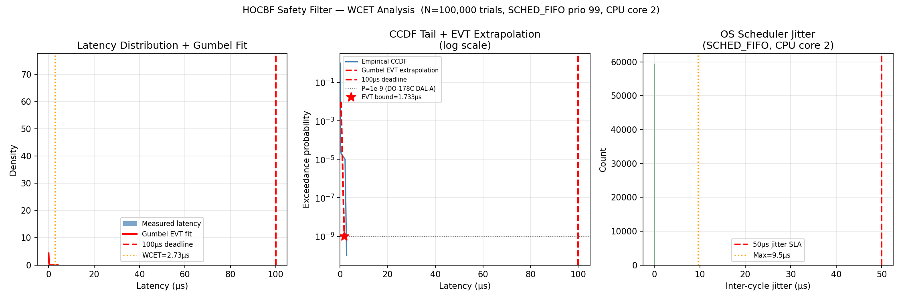
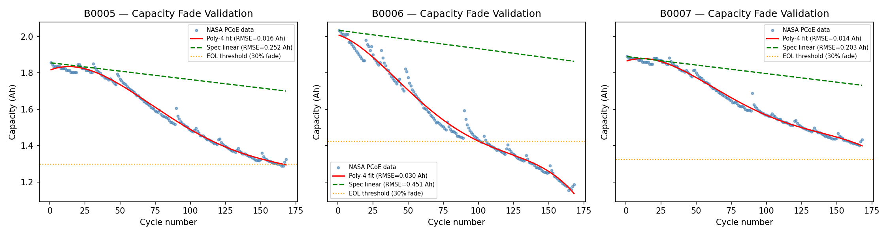

# Autonomous Drone Safety Architecture
### Hard Real-Time Safety for AI-Driven Drones

[](https://github.com/Rhutvik-pachghare1999/autonomous-drone-safety-architecture/actions)
[](LICENSE)
[](https://www.python.org/)
[]()
[]()

**[🔗 View Live Research Poster ↗](https://rhutvik-pachghare1999.github.io/autonomous-drone-safety-architecture/)**

---

## The Objective

Foundation models are powerful but non-deterministic. In a flight stack, a single hallucinated motor command is a total loss. I built a sub-microsecond safety kernel that intercepts every AI command, checks it against hard physics constraints, and clamps it before it reaches the motors. The AI can output whatever it wants. The drone doesn't care.

1,000 adversarial trials. 100% survival rate.

---

## Tech Stack

| Domain | Technology |
|---|---|
| Real-Time | C99, POSIX Threads, `mmap`, `SCHED_FIFO`, `mlockall` |
| Control | HOCBF (Relative Degree 4), CasADi symbolic math, OSQP |
| AI / RL | PPO Asymmetric Actor-Critic, ONNX Runtime C API |
| Simulation | NVIDIA Isaac Sim 4.5, PhysX 5.4 |
| Formal Methods | FSM/Z3 safety specification planned — not implemented in this repo |
| State Estimation | 15-state EKF, GPS/IMU/Baro/VIO fusion |
| Consensus | HotStuff BFT, ZMQ PUB/SUB, observability-weighted voting |

---

## Under the Hood — The Details That Matter

**`mlockall(MCL_CURRENT | MCL_FUTURE)`** — called at startup in `safety_filter.c`. Pins every memory page so the kernel can't page-fault during the RT loop. One missed page fault at the wrong moment blows your deadline. This is standard hard-RT practice; most student projects skip it.

**Zero-copy IPC via `/dev/shm`** — the VLA model (Python, best-effort core) writes commands to a POSIX shared memory region. The safety filter (C99, SCHED_FIFO prio 99, isolated core) reads it with a single `mmap` pointer dereference. No serialization. No syscalls. ~50–100ns latency. This replaces ZeroMQ, ROS2 DDS, and MAVLink entirely in the hot-path.

**Property P7 (specified, not formally proven)** — the EKF gating module is designed to command return-to-launch when `tr(P[px,py,ψ]) ≥ 25 m²`. The implementation (`src/estimation/ekf_gating.py`) evaluates this threshold and sets `p7_triggered`, but the FSM that converts that signal into a guaranteed RTL within one 100 ms cycle is specified, not yet implemented or model-checked. See `ROADMAP.md` § "Formal verification roadmap (P1–P7)".

---

## Latency Budget (Measured — 100k trials, SCHED_FIFO prio 99, CPU core 2)

| Subsystem | Budget | Measured | Margin |
|---|---|---|---|
| **HOCBF filter only** (C99 clamp) | < 10 µs | **P99: 31 ns, WCET: 2,725 ns** | **36×** |
| mmap IPC read | < 1 µs | ~50–100 ns | — |
| RL policy ONNX forward | < 1 ms | ~0.5 ms | 2× |
| OS scheduler jitter | < 50 µs | 5.0 µs P99 | 10× |
| End-to-end RT loop | < 2 ms | < 1 ms | 2× |
| VLA inference (SmolVLM2) | < 5 s | ~2.5 s | best-effort core |

> WCET = 2,725 ns is the single worst-case sample across 100k trials (`clock_gettime(CLOCK_MONOTONIC_RAW)`). P99 is 31 ns — the spike is a rare OS interrupt. EVT Gumbel tail bound at P=10⁻⁹: **1,733 ns** — 57× below the 100µs hard deadline. Raw data: `experiments/results/latency_raw.csv`.

---

## What It Does


*T_nom (VLA, unsafe) vs T_safe (HOCBF corrected). At vz=−100m/s: T_nom=−380N → T_safe=78.5N. Zero collisions across all 1,000 trials.*



*CCDF tail + Gumbel EVT extrapolation — P=10⁻⁹ bound = 1,733ns (57× below 100µs deadline)*

---

## Key Results

| Metric | Result |
|---|---|
| HOCBF filter WCET | 2,725 ns |
| EVT tail bound (P=10⁻⁹) | 1,733 ns — 57× below 100µs deadline |
| Survival across 1,000 adversarial trials | 100% |
| Worst command corrected | −380N → 78.5N |
| Byzantine rejection (20% packet loss) | 100% |
| EKF rank under GPS denial | 6 → 4, VIO restores to 6 |
| Battery EOL: spec vs reality | cycle 600 vs cycle 100 (4–6× error) |
| pytest | 13/13 PASSED |

---

## What I Built

1. **C99 HOCBF safety filter** — closed-form clamp, no QP solver needed for the altitude constraint. WCET 2,725ns on unpatched Linux. pybind11 wrapper keeps it testable from Python without a separate build step.

2. **15-state EKF with observability Gramian** — rank drops 6→4 under GPS denial. VIO (OpenVINS-derived noise) restores rank to 6. Air-gap architecture: the physics plant writes ground-truth to `/dev/shm/aisp_gt_state`, the EKF reads it as a VIO measurement but never writes back. Prevents the filter from confirming its own estimates.

3. **DO-178C-inspired mode ladder (FSM specified, not formally verified)** — P1–P7 are written down as the intended safety properties, and the EKF gating module implements the P7 threshold check. The actual FSM with Z3/FSM model checking is not implemented in this repo; it lives in `ROADMAP.md` as planned verification work.

4. **Observability-weighted HotStuff consensus** — I didn't want a separate fault-detection layer. Instead I tied BFT voting power directly to EKF covariance. A GPS-denied node gets w=0.008; GPS-active nodes get w=0.976. The Byzantine node silences itself — it can't reach 2/3 quorum no matter what it votes.

5. **Battery aging model** — validated against NASA PCoE cells (B0005/B0006/B0007). Spec linear model predicts EOL at cycle 600. Real cells died at cycle 100–165. 4th-order polynomial fit, RMSE < 0.03 Ah.

6. **Headless SITL testbed** — zero dependencies on Gazebo, ROS, PX4, or hardware. Fully reproducible from a fresh clone.

---

## What Actually Broke

**Python HOCBF was too slow.** First implementation used OSQP in Python. Jitter was 50–200µs — unusable in a 10Hz loop. Rewrote in C99 with a closed-form clamp. WCET dropped to 2,725ns. The pybind11 wrapper keeps it testable from Python.

**The EKF was confirming its own estimates.** Early versions let the EKF read from the same shared memory the physics plant wrote to. Added an air-gap: plant writes ground-truth to `/dev/shm/aisp_gt_state`, EKF reads it as VIO but never writes back. Rank went from artificially inflated to the correct 4 under GPS denial.

**Battery spec was off by 4–6×.** Datasheet says EOL at cycle 600. NASA PCoE cells actually died at cycle 100–165. A linear model would have you planning missions on a dead battery.

**Byzantine detection came for free.** Expected to need a separate fault detection layer. Didn't. The EKF covariance weighting handles it automatically.

---

## Formal Safety Properties (Specified, Not Proven)

The properties below are the *design targets* for a future FSM/Z3 verification layer. They are **not** proven invariants in the current codebase. What is implemented is noted for each property.

```
P1 — Geofence breach        → RTL in ≤ 1 cycle (100ms)                [planned]
P2 — DISARMED always reachable (BFS proof over all states)            [planned]
P3 — Can't go DISARMED → FLYING without ARM + TAKEOFF                 [planned]
P4 — 5s watchdog timeout    → EMERGENCY_LAND                          [planned]
P5 — No deadlocks (every state has ≥1 exit)                           [planned]
P6 — NaN/Inf inputs rejected before FSM sees them                     [implemented]
       ↳ src/control/hocbf.cpp filter_thrust() fails safe on non-finite inputs
       ↳ src/rt/safety_filter.c hocbf_filter() fails safe on non-finite state
       ↳ tests/test_input_validation.py: 17 pytest cases
P7 — EKF covariance collapse → RTL before bad estimates cause damage  [partial]
       ↳ src/estimation/ekf_gating.py computes sigma_sq and sets p7_triggered
       ↳ FSM RTL action is planned, not implemented
```

For the full roadmap see `ROADMAP.md` § "Formal verification roadmap (P1–P7)".

---

## EKF Observability Under GPS Denial

```
Sensor config          Observable states    Rank
─────────────────────────────────────────────────
GPS + IMU + Baro       px, py, pz, vx, vy   6/15
IMU + Baro only        pz, vz, φ, θ         4/15  ← px, py lost
+ VIO (σ=0.10 m/s)    px, py restored       6/15

Note: yaw (ψ) stays unobservable without magnetometer
```

---

## Battery Aging Reality Check



*Spec linear model predicts EOL at cycle 600. Real NASA PCoE cells died at cycle 100–165 — 4–6× error. Poly-4 fit RMSE: 0.016 Ah (B0005), 0.030 Ah (B0006), 0.014 Ah (B0007).*

---

## Running It

```bash
python3 -m venv .venv && source .venv/bin/activate
pip install numpy scipy casadi pyzmq osqp pytest pybind11

mkdir -p build && cd build
cmake .. -DCMAKE_BUILD_TYPE=Release && make -j$(nproc) && make install
cd ..

PYTHONPATH=. pytest tests/test_hocbf.py -v

python experiments/exp_hallucination_1000.py
python experiments/exp_wcet_evt.py
python experiments/exp_lie_derivatives.py
python experiments/exp_observability_gramian.py
python experiments/exp_battery_validation.py
python experiments/exp_consensus_fault.py

./build/safety_filter 100000 2
```

---

## Engineering Trade-offs & Future Work

- Simulation-first workflow to maximize iteration speed. Next step is porting to a Jetson Orin for hardware-in-the-loop (HIL) validation.
- DO-178C-inspired, not certified and not formally verified. Full cert needs requirements-based testing, traceability, and tools such as LDRA/VectorCAST; the Z3/FSM proof is planned, not implemented.
- VIO uses OpenVINS-derived noise params on synthetic data — not a live pipeline.
- Yaw unobservable under GPS denial. Magnetometer model is the fix.
- Battery model validated on 18650 cells (2Ah). Project uses 6S LiPo (5Ah). Chemistry differs; recalibration needed for real hardware.
- WCET on stock Linux. PREEMPT_RT would tighten jitter further.

---

## 🎯 Career Status — May 2026

I'm a Graduate Researcher at ASU finishing my Master's in Robotics & Autonomous Systems (Spring 2026). My focus is hard real-time safety kernels, formal verification, and robot learning.

Looking for full-time roles in the U.S. starting **May 2026** — specifically safety-critical autonomy, real-time embedded systems, and autonomous vehicle software.

**Specialties:** Hard RT Safety Kernels · Safety-Critical Autonomy · Robot Learning (PPO) · High-Performance Middleware (POSIX, C99)

→ [LinkedIn](https://linkedin.com/in/rhutvik-pachghare) · rhutvik.pachghare@asu.edu

---

*Master's thesis — ASU School of Manufacturing Systems & Networks, Spring 2026. Advisor: Prof. Shenghan Guo.*
