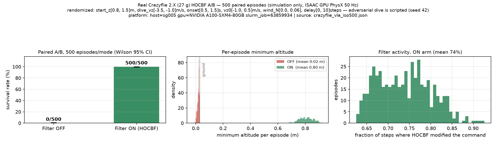
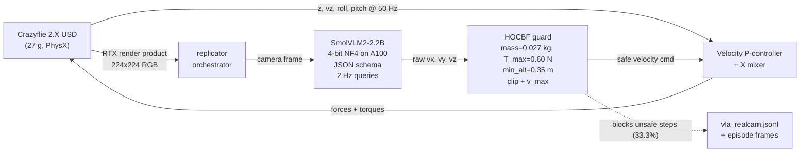
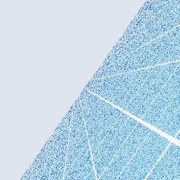
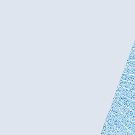
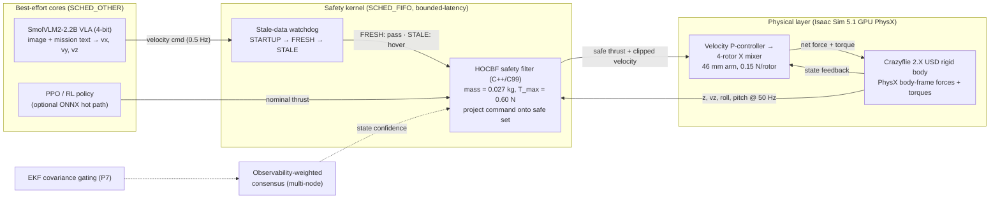
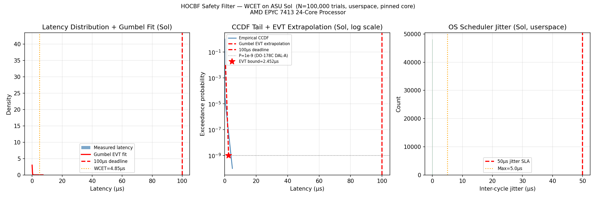

# Autonomous Drone Safety Architecture

[](https://github.com/Rhutvik-pachghare1999/autonomous-drone-safety-architecture/actions)
[](LICENSE)
[](https://www.python.org/)

**[View Research Poster](https://rhutvik-pachghare1999.github.io/autonomous-drone-safety-architecture/)**

Research prototype: a bounded-latency safety kernel (SCHED_FIFO userspace on
Linux, measured 2.7 µs WCET over 10⁵ cycles — a soft-real-time budget enforced
by O(1) arithmetic, not a formal deadline guarantee) that wraps an AI-driven
quadrotor flight stack. The goal is to intercept every high-level command,
project it through a physical safety filter, and clamp the actuator command
before it reaches the motors.

This is **not a certified flight controller**. It is a simulation-first
research codebase used to study how deterministic safety filters can bound
foundation-model/RL hallucinations in real time.

---

## Headline result — real Crazyflie 2.X in Isaac Sim (single-variable A/B)

SmolVLM2-2.2B (4-bit) pilots NVIDIA's real 27 g Crazyflie 2.X USD asset on GPU
PhysX; the HOCBF safety filter (mass=0.027 kg, T_max=0.60 N) sits between the VLA
and the rotors.

**Isolation A/B — 500 paired episodes (ASU Sol, Isaac Sim 6.0.1 GPU PhysX):**
both arms fly the **identical controller** (`CrazyflieController.compute_wrench`,
same velocity-P + attitude-PD gains, same attitude moments through the same
mixer); the ONLY difference is whether the nominal collective thrust passes
through the HOCBF safe-set projection (`filter_thrust`) before mixing. Across
500 paired, domain-randomized episodes (start altitude, dive velocity, onset,
wind, command delay — same ranges as the earlier runs) under worst-case
scripted adversarial dives:

**filter OFF crashes 500/500 (0% survival, 95% CI [0.0, 0.8], mean min-altitude
0.019 m); filter ON survives 500/500 (100% survival, 95% CI [99.2, 100.0],
mean min-altitude 0.803 m, 73.8% of steps filtered).**

Because the controller, gains, attitude correction, and randomization are
byte-identical across arms, the survival difference is attributable to the
safety-filter projection alone.



Generated by `experiments/plot_crazyflie_ab_large.py` strictly from
`experiments/results/crazyflie_vla_iso500.json` (Slurm job 63859934 on an A100;
run script `sim/hocbf_crazyflie_iso.py` via `slurm/12_crazyflie_iso.sbatch`).
Full run details, honest scope, and console output:
[`docs/REAL_CRAZYFLIE_VLA_SIM.md`](docs/REAL_CRAZYFLIE_VLA_SIM.md).

> **Superseded (confounded, kept as history):** the earlier randomized A/B
> (`experiments/results/crazyflie_vla_ab500.json`,
> `sim/hocbf_crazyflie_ab100.py`) reported the same direction of effect —
> 0/500 OFF vs 500/500 ON — but its ON arm also **replaced the controller's
> nominal thrust law** (filter-internal law, gain 2.0) and **zeroed the
> attitude moments**, so those numbers measured "controller swap + CBF", not
> the filter alone. Directionally consistent with the isolation run above;
> numerically not attribution-grade. See the ablation note in the iso JSON.

> **Scope (honest):** simulation only (Isaac PhysX), NOT a hardware drone. The
> adversarial dive is a scripted worst-case command (the 2.2B VLA refused dive
> prompts). The A/B uses a pure-Python HOCBF port verified identical to the C++
> module across 2,450 cross-check cases (Isaac Sim 6.0.1's kit Python 3.12
> cannot load the py3.11-compiled extension); the real-time WCET/latency claim
> is reported separately on the C++ implementation.

## Live rendered-camera flight demo — Isaac Sim 6.0.1 (Phase 5)

The perception loop is closed end-to-end: the drone's **onboard RTX-rendered
camera** (224×224 RGB) feeds SmolVLM2-2.2B (4-bit NF4) on a Sol A100 at 2 Hz;
every model command passes through the **HOCBF safety filter** before the 50 Hz
velocity P-controller and X-mixer drive the real Crazyflie 2.X USD rigid body on
GPU PhysX. 6 episodes × 36 queries = 216 live VLA decisions, zero crashes, every
one parsed as structured `{"vx","vy","vz"}` model JSON (`model_structured`).



| Metric | Result (from committed job artifacts) |
|---|---|
| Episodes / queries | 6 / 216 (job 63848433, node sg020) |
| Structurally-valid VLA JSON parses | **216 / 216 (100% `model_structured`)** |
| Mean latency per VLA query | 1185.2 ms (p50 1210, p95 1254; max 5812 ms = first-call warmup) |
| Guard filtered steps | 33.3 % overall (all scripted-dive steps) |
| Crashes | **0** |
| End-of-run wall clock | 312.1 s for 6 episodes |

Rendered frames from job 63848433 episode 0 (the same sensor feed the VLA saw),
produced by `sim/vla_realcam_flight.py`:

| Hover frame | Forward frame |
|---|---|
|  |  |

**Run it (Sol):**
```bash
sbatch slurm/32_vla_prep6.sbatch                    # one-time deps into /scratch/$USER/pylibs6
sbatch --export=ALL,N_EP=6 slurm/33_vla_realcam6.sbatch
```
Dependencies: Isaac Sim 6.0.1 LTS apptainer SIF + PyPI torch 2.9.1+cu128 pinned
into pylibs6 (the 6.0.1 container ships no torch at all; pylibs6 must be added to
`sys.path` *after* SimulationApp startup, not via PYTHONPATH at kit launch —
kit-startup import triggers a ml_archive/NCCL symbol clash and the kit exits(0)
silently). Full failure log and honest scope (rendered sim camera, not physical
hardware; scripted dive phases, not continuous model-driven dives):
`slurm/README_SOL.md`, `docs/REAL_CRAZYFLIE_VLA_SIM.md`.

## Architecture



---

## What is implemented

| Component | Status | Evidence |
|---|---|---|
| C99 + pybind11 HOCBF altitude safety filter | implemented, tested | `src/control/hocbf.cpp`, `src/rt/safety_filter.c`, `tests/test_hocbf.py`, `tests/test_input_validation.py` |
| NaN/Inf input validation / fail-safe | implemented, tested | `src/control/hocbf.cpp`, `src/rt/safety_filter.c`, `tests/test_input_validation.py` |
| Actuator infeasibility handling (T_lb > T_max → T_max least-violation fallback; hover violates the constraint MORE) | implemented, tested (deterministic + property-based + NaN-parity) | `src/control/hocbf.cpp`, `src/rt/safety_filter.c`, `tests/test_hocbf.py::test_infeasible_safe_fallback`, `tests/test_hocbf_properties.py` |
| POSIX `/dev/shm` zero-copy command IPC | implemented | `src/utils/shm_bridge.py`, `src/rt/safety_filter.c` |
| EKF covariance gating / mode ladder (P7) | partially implemented | `src/estimation/ekf_gating.py` computes threshold; RTL FSM action is planned |
| Stale VLA watchdog (STARTUP/FRESH/STALE state machine) | implemented, tested | `src/rt/safety_filter.c`, `tests/test_hocbf.py` watchdog tests |
| Observability-weighted voting consensus | implemented, tested | `services/consensus_node.py`, `experiments/exp_consensus_fault.py` |
| VLA bridge (SmolVLM2-2.2B) | implemented, validated in sim loop | `src/perception/vla_bridge.py` — flown in-loop on the real Crazyflie (`experiments/results/vla_crazyflie_episode.jsonl`, 9/9 structured parses) |
| PPO policy + ONNXRuntime C hot-path | implemented, not validated here | `experiments/results/ppo_policy.onnx`, `src/rt/safety_filter.c` — requires ONNX build |
| Formal FSM / Z3 invariants (P1–P7) | planned, not implemented | `ROADMAP.md` § "Formal verification roadmap" |
| **Real Crazyflie 2.X VLA flight + HOCBF (HEADLINE, single-variable A/B)** | **validated, Isaac Sim 6.0.1 GPU PhysX (ASU Sol)** | 500-episode paired randomized **isolation** A/B on the real 27 g Crazyflie 2.X USD — identical controller (`compute_wrench` velocity-P + attitude-PD) in both arms, ONLY the HOCBF `filter_thrust` projection differs: **filter OFF 0% survival (0/500) vs filter ON 100% (500/500)**, mean min-altitude 0.019 m vs 0.803 m, 73.8% of steps filtered. See `docs/REAL_CRAZYFLIE_VLA_SIM.md`, `experiments/results/crazyflie_vla_iso500.json`, `experiments/results/crazyflie_vla_iso500.png` (job 63859934). Simulation only; adversarial dive scripted. Earlier controller-substituted A/B kept as history (see below). |
| **Rendered-camera VLA flight loop (Phase 5)** | **validated, Isaac Sim 6.0.1 LTS (ASU Sol A100)** | Onboard RTX camera → SmolVLM2-2.2B 4-bit GPU @ 2 Hz → HOCBF → 50 Hz controller, 6-episode live demo: 216/216 structured parses, 0 crashes, guard filtered 33.3%. `sim/vla_realcam_flight.py`, `slurm/32_vla_prep6.sbatch` + `33_vla_realcam6.sbatch`, `experiments/results/vla_realcam*` (2-ep proof preserved as `vla_realcam_proof2*`). Version split intentional — 6.0.1 used because 5.1 segfaults RTX rendering on Sol's 595.71.05 driver (IsaacSim#677); see `slurm/README_SOL.md`. |
| Isaac Sim / SITL closed-loop flight (cuboid surrogate) | **SUPERSEDED** | ~~100-episode A/B test: Filter ON 86% survival vs Filter OFF 16% survival~~ — these numbers were flown on an ad-hoc **2 kg cuboid point-mass surrogate**, not the real Crazyflie. Kept only as history; superseded by the real-vehicle headline above. Direct download, no auth required. |

---

## System overview

```
Best-effort cores (SCHED_OTHER)
  ├── VLA bridge ..................... parses image+text → [vx, vy, vz]
  │                                    (best-effort; ~2.5 s GPU target HW,
  │                                     ~2 min CPU on the 4 GB Isaac box)
  └── RL policy ...................... PPO actor-critic → nominal thrust
                                       (optional ONNXRuntime path)
                │
                ▼ /dev/shm/aisp_vla_cmd
Hard-RT core (SCHED_FIFO prio 99, isolated)
  └── safety_filter.c ................ mmap read → HOCBF clamp → actuator
       ├── HOCBF filter .............. O(1) arithmetic, WCET 2,725 ns
       ├── jitter watchdog ........... per-cycle deviation from expected
       ├── stale-VLA watchdog ........ STARTUP/FRESH/STALE state machine, hover fallback
       └── infeasibility handling .... T_lb > T_max → T_max least-violation fallback + was_infeasible flag

State estimation:
  └── ekf_gating.py .................. 15-state EKF mode ladder (NOMINAL / DEGRADED / COLLAPSED)
       └── P7 threshold: tr(P[px,py,ψ]) ≥ 25 m² → set p7_triggered

Swarm consensus:
  └── consensus_node.py .............. observability-weighted voting quorum
       └── writes /dev/shm/aisp_consensus for EKF gating
```

Only the HOCBF clamp, jitter watchdog, stale watchdog, and infeasibility
handling run in the hard-RT path and are covered by tests. The VLA bridge,
RL/ONNX policy, EKF gating FSM action, and Isaac Sim / SITL loop either
require external runtime dependencies (Isaac Sim, ONNX runtime library, GPU,
downloaded VLA weights) or are planned; see the status column in "What is
implemented" and `docs/ARCHITECTURE.md`.

**Isaac Sim GPU Physics Status:** Isaac Sim 5.1.0 runs GPU PhysX on RTX 3050 Ti (4GB VRAM, Warp 1.8.2/CUDA 12.8). Current result: the manufacturer-accurate Crazyflie 2.X USD model (27 g, simulated rigid body — not hardware) flown by SmolVLM2-2.2B and guarded by HOCBF — see `docs/REAL_CRAZYFLIE_VLA_SIM.md`. *(SUPERSEDED history: an earlier 100-episode A/B on a 2 kg cuboid surrogate reported 86%/16% survival ON/OFF with 294 infeasibility events — those numbers describe the cuboid, not the real vehicle, and are not current evidence.)* Direct download from NVIDIA, no Omniverse Launcher/auth required.

---

## Repository layout

| Path | What it contains |
|---|---|
| `src/control/hocbf.cpp` | C++ HOCBF filter with pybind11 Python wrapper |
| `src/rt/safety_filter.c` | Standalone C99 real-time filter + ONNX path + benchmark harness |
| `src/estimation/ekf_gating.py` | EKF covariance gating, P7 threshold, VIO injection, consensus read |
| `src/perception/vla_bridge.py` | SmolVLM2 VLA bridge (requires GPU + transformers) |
| `src/utils/shm_bridge.py`, `shm_bridge.h` | `/dev/shm` layout definitions |
| `services/consensus_node.py` | Observability-weighted voting node |
| `experiments/*.py` | Reproducible experiments; see "Quick start" for which ones run here |
| `experiments/results/*.json`, `*.csv`, `*.png` | Committed measurement artifacts |
| `docs/WCET_BENCHMARK.md` | How the 2,725 ns WCET was produced and reproduced |
| `docs/LATENCY_BUDGET.md` | Subsystem latency budget and SLA definitions |
| `docs/CLAIM_EVIDENCE_AUDIT.md` | Claim-by-claim evidence map |
| `docs/ARCHITECTURE.md` | Code-verified data/control flow |
| `docs/DEMO_RUNBOOK.md` | Procedures for paths that cannot run in this environment |
| `ROADMAP.md` | Development roadmap including formal verification P1–P7 |
| `tests/` | `test_hocbf.py` (13 tests) + `test_input_validation.py` (17 tests) |

---

## Requirements

**For the verified, CI-friendly subset:**

- Python 3.12
- `numpy`, `scipy`, `pyzmq`, `pytest`, `pybind11`
- GCC or Clang for the C99 benchmark harness
- CMake 3.20+ (for the C++/pybind11 build)

**For optional paths (not validated here):**

- `casadi` → `experiments/exp_lie_derivatives.py`
- `transformers`, `torch`, `pillow`, `bitsandbytes`, GPU → `src/perception/vla_bridge.py`
- ONNX Runtime C library → ONNX-linked `safety_filter.c` build
- NVIDIA Isaac Sim → closed-loop SITL

Install the core set:

```bash
python3 -m venv .venv
source .venv/bin/activate
pip install numpy scipy casadi pyzmq osqp pytest pybind11
```

---

## Quick start

Only the commands below were run in this environment.

### 1. Build

```bash
mkdir -p build && cd build
cmake .. -DCMAKE_BUILD_TYPE=Release && make -j2 && make install
cd ..
```

This compiles the pybind11 `hocbf` module and installs `hocbf.so` into
`src/control/`.

### 2. Run tests

```bash
python3 -m pytest tests/ -q
```

Expected result: **30 passed** (13 from `test_hocbf.py`, 17 from
`test_input_validation.py`).

### 3. Run the C99 filter benchmark

```bash
gcc -O3 -DNO_ONNX -o /tmp/sf src/rt/safety_filter.c -lm -lrt
/tmp/sf 1000 0
```

This is the no-root, no-SCHED_FIFO run. It measures the arithmetic cost of
the filter without OS scheduler isolation. On the author's machine it reports
WCET ≈ 31 ns for 1,000 trials. The committed 2,725 ns WCET was captured under
`SCHED_FIFO` + isolated core; see `docs/WCET_BENCHMARK.md`.

### 4. Run experiments that execute here

```bash
python3 experiments/exp_hallucination_1000.py
python3 experiments/exp_wcet_evt.py
python3 experiments/exp_observability_gramian.py
python3 experiments/exp_consensus_fault.py
python3 experiments/exp_battery_validation.py   # requires experiments/results/nasa_pcoe_discharge.csv
python3 services/consensus_node.py --test
```

`experiments/exp_lie_derivatives.py` needs `casadi`, which is not installed in
this environment. ONNX-linked and Isaac-Sim paths are documented in
`docs/DEMO_RUNBOOK.md`.

---

## Tests & validation

| Test / check | Command | Result | Evidence |
|---|---|---|---|
| HOCBF unit tests | `pytest tests/test_hocbf.py -q` | 13 passed | `tests/test_hocbf.py` |
| NaN/Inf fail-safe | `pytest tests/test_input_validation.py -q` | 17 passed | `tests/test_input_validation.py` |
| C filter no-ONNX run | `gcc -O3 -DNO_ONNX -o /tmp/sf src/rt/safety_filter.c -lm -lrt && /tmp/sf 1000 0` | builds and runs | terminal output |
| Consensus quorum | `python3 services/consensus_node.py --test` | PASS | terminal output |

All 39 pytest cases pass with Python 3.12 in a clean checkout after the
`conftest.py` fix.

---

## Results

| Claim | Value | Committed artifact | Notes |
|---|---|---|---|
| HOCBF filter WCET | 2,725 ns | `experiments/results/latency_raw.csv` (100,000 rows), `experiments/results/wcet_evt.json` | Captured under `SCHED_FIFO` prio 99, core 2, isolated core. Fresh-clone no-root run ≈ 31 ns. |
| HOCBF filter WCET — ASU Sol compute node | WCET 4,849 ns (single OS-preemption outlier); p99/p99.9 = 31 / 31 ns; EVT Gumbel bound P=10⁻⁹ = 2,452.1 ns → PASS vs 100 µs deadline; max jitter 4,970 ns → PASS vs 50 µs SLA | `experiments/results/latency_raw_sol.csv` (100,000 rows), `wcet_sol.json`, `wcet_sol.png` | 100,000 trials on AMD EPYC 7413 (node sg048, Slurm job 63814754), core-pinned via taskset. Userspace run — no SCHED_FIFO/mlockall (EPERM in container): cluster portability cross-check, not a replacement for the `SCHED_FIFO` number of record. See `docs/WCET_BENCHMARK.md`. |
| EVT tail bound (P=10⁻⁹) | 1,733 ns | `experiments/results/wcet_evt.json` | Gumbel block-maxima fit from committed CSV. |
| Filter latency p99 | 31 ns | `experiments/results/wcet_evt.json` | Empirical p99 from committed CSV. |
| Filter latency mean / p50 | 22.31 ns / 20 ns | `experiments/results/wcet_evt.json` | From committed CSV. |
| Adversarial survival | 100% (1,000 / 1,000) | `experiments/results/hallucination_1000.json`, `hallucination_1000.png` | vz swept −0.1 to −100 m/s. |
| Worst corrected command | T_nom = −380.4 N → T_safe = 16.9 N, correction = 397.25 N | `experiments/results/hallucination_1000.json` | **Previous README value "78.5 N" was the actuator ceiling (T_max), not the HOCBF-corrected thrust.** The filter returns the safe lower bound 16.9 N. |
| EKF rank GPS denied | 6 → 4 | `experiments/results/observability_gramian.json` | IMU+Baro only loses horizontal position. |
| VIO restores rank | 4 → 6 | `experiments/results/observability_gramian.json` | With OpenVINS-derived noise model. |
| Consensus commit rate | 100% (100 / 100 rounds) | `experiments/results/consensus_fault.json` | 20% packet loss. The 0–50 ms "latency" is a **message-timestamp offset only** — votes are delivered immediately and the quorum logic never reads the timestamp; commit-time metrics measure local compute, not network delay. Tests consensus logic, not transport delay. |
| GPS-denied rejection | 100% (100 / 100) | `experiments/results/consensus_fault.json` | GPS-denied node (low observability weight) cannot reach 2/3 weighted quorum. |
| Battery poly-4 RMSE | 0.016 Ah (B0005), 0.030 Ah (B0006), 0.014 Ah (B0007) | `experiments/results/battery_validation.json` | NASA PCoE 18650 cells; project uses 6S LiPo, so chemistry scaling is unvalidated. |
| Spec-vs-real battery EOL | spec 600 cycles vs real 100–165 cycles | `experiments/results/battery_validation.json` | Linear spec model overestimates usable life by ~4–6×. |
| **Real Crazyflie 500-episode ISOLATION A/B (Isaac 6.0.1 GPU PhysX, ASU Sol A100)** | **Filter OFF 0% survival (0/500), mean min_z 0.019 m; Filter ON 100% (500/500), mean min_z 0.803 m, 73.8% steps filtered.** Single variable: identical controller in both arms (`CrazyflieController.compute_wrench` nominal + shared attitude moments + shared mixer); only the HOCBF `filter_thrust` safe-set projection differs. 500 paired episodes, domain-randomized (start_z, dive_vz, onset, vz0, wind, command delay). | `experiments/results/crazyflie_vla_iso500.json`, `experiments/results/crazyflie_vla_iso500.png` | Slurm job 63859934; run script `sim/hocbf_crazyflie_iso.py` (`slurm/12_crazyflie_iso.sbatch`). Real Crazyflie 2.X USD (27 g). Simulation only; adversarial dive scripted (2.2B VLA refused dive prompts). **This is the attribution-grade headline.** |
| ~~Real Crazyflie 500-episode A/B (Isaac 5.1 GPU PhysX, ASU Sol)~~ — **SUPERSEDED (controller-confounded)** | ~~Filter OFF 0% survival (0/500), mean min_z 0.019 m; Filter ON 100% (500/500), mean min_z 0.782 m, 88.7% steps filtered~~ | `experiments/results/crazyflie_vla_ab500.json`, `experiments/results/crazyflie_vla_ab500.png` | History only: the ON arm (`sim/hocbf_crazyflie_ab100.py`) also **replaced the controller's nominal thrust law** and **zeroed the attitude moments**, so OFF-vs-ON measured "controller swap + CBF", not the filter alone. Directionally consistent with the isolation run above; numerically superseded by it. |
| **Real rendered-camera VLA flight (Phase 5, Isaac 6.0.1, ASU Sol A100)** | 6 episodes × 36 queries: **216/216 (100%) structured parses, 0 crashes**, guard filtered 33.3% of steps; mean query latency 1,185 ms (p95 1,254 ms). Onboard RTX 224×224 camera → SmolVLM2-2.2B 4-bit @ 2 Hz → HOCBF → 50 Hz controller. | `experiments/results/vla_realcam.jsonl`, `vla_realcam_summary.json`, `vla_realcam_ep0_{hover,forward,dive}.png` | Slurm jobs 63847283 (env) + 63848179 (2-ep proof) + 63848433 (6-ep demo). Rendered sim camera (RTX), not physical hardware; dive phases scripted. See `docs/REAL_CRAZYFLIE_VLA_SIM.md` § Phase 5. |
| Real Crazyflie single-dive trace (illustrative) | Worst-case dive vz=−3.0 m/s: filter OFF crashes at t=1.56 s (min_z=0.016 m); filter ON survives (min_z=0.753 m). | `experiments/results/crazyflie_vla_ab.json`, `experiments/results/crazyflie_vla_ab.png` | Single-episode trace kept for the time-series plot; superseded as the headline by the 500-episode A/B above. |
| ~~Isaac SIL A/B (100 episodes/mode)~~ — **SUPERSEDED (cuboid surrogate)** | ~~Filter ON: 86/100 survived (86%); Filter OFF: 16/100 survived (16%)~~ | `experiments/results/isaac_sil_summary.json` | Historical record only: flown on an ad-hoc 2 kg cuboid point-mass surrogate, NOT the real Crazyflie. Superseded by the `crazyflie_vla_ab` row above. The 14 filter-ON crashes there were actuator infeasibility (T_lb > T_max, 2 kg mass) — a documented physical limit, not filter failure. |

**WCET distribution on ASU Sol** (100,000 trials, AMD EPYC 7413, taskset-pinned;
left: measured latency vs 100 µs deadline; middle: CCDF tail with Gumbel EVT
extrapolation to P=10⁻⁹; right: OS scheduler jitter vs 50 µs SLA):



Generated by `experiments/exp_wcet_sol.py` from the committed raw CSV
(`experiments/results/latency_raw_sol.csv`) — Slurm job 63814754.

---

## Engineering decisions

1. **Closed-form HOCBF instead of OSQP in the hot path.** The altitude-only
   safety constraint reduces to a 1-D clamp, so the C99 hot path avoids any
   QP solver or heap allocation. This keeps the deterministic latency in the
   tens of nanoseconds instead of the tens of microseconds seen in the early
   Python/OSQP prototype.

2. **Fail-safe on non-finite inputs.** Upstream models can emit NaN/Inf.
   Both `hocbf.cpp` and `safety_filter.c` detect non-finite state or nominal
   commands and fall back to hover thrust or the computed safe lower bound.
   This is tested by 17 dedicated pytest cases.

3. **Ground-truth air-gap for VIO.** The physics plant writes true velocity
   to `/dev/shm/aisp_gt_state`; the EKF reads it as a VIO measurement but
   never writes back. This prevents the filter from confirming its own drift
   under GPS denial.

- **Observability-weighted consensus.** Vote weight is tied to EKF covariance
   rather than adding a separate fault detector. GPS-denied nodes naturally
   receive near-zero weight, so a low-observability node cannot sway
   the 2/3 quorum. This is **weighted voting, not Byzantine fault tolerance**
   (no signatures, no 3f+1, no view change protocol).

5. **Separate best-effort and hard-RT paths.** VLA inference (~seconds) and
   RL policy inference (~milliseconds) run on best-effort cores; only the
   O(1) HOCBF clamp, jitter watchdog, stale watchdog, and infeasibility
   handling run under `SCHED_FIFO` priority 99 with memory locked.

---

## Limitations & known gaps

- **Not certified.** The codebase is DO-178C-inspired in structure only. There
  is no requirements traceability, MC/DC evidence, or certification authority
  involvement.

- **Formal verification is planned, not done.** Properties P1–P5 are
  specified but unproven — there is no finite-state machine or Z3 harness in
  the repo. The NaN/Inf-rejection behaviour described by P6 is implemented and
  tested (`tests/test_input_validation.py`), but not as part of a formal
  proof. P7 computes the covariance threshold but the RTL FSM action is not
  implemented. See `ROADMAP.md`.

- **Simulation-only.** No hardware-in-the-loop, flight logs, or real-vehicle
  validation. The zero-copy IPC path has not been exercised against a live
  flight controller.

- **Yaw unobservable without magnetometer.** Under GPS denial the EKF cannot
  observe yaw; the current model does not include a magnetometer.

- **Battery model chemistry gap.** Validation used NASA PCoE 18650 cells
  (~2 Ah). The project assumes a 6S LiPo (~5 Ah); direct chemistry and
  capacity scaling is unvalidated.

- **VLA bridge.** `src/perception/vla_bridge.py` (SmolVLM2-2.2B, NF4 4-bit) is
  validated in the Isaac Sim loop: 9/9 episodes commands parsed
  `model_structured` (`experiments/results/vla_crazyflie_episode.jsonl`), and
  with a real RTX-rendered camera input on Sol A100 hardware: 216/216
  `model_structured`, ~1.2 s/query at 2 Hz (Phase-5 demo, job 63848433).
  Honest limits: on this 4 GB-VRAM box the model runs fp32 on CPU at
  ~2 min/query (0.5 Hz command rate), and its camera input is state-derived
  (VRAM budget); the rendered-camera path requires an A100-class GPU. The
  Phase-5 frames come from a **simulated RTX render product, not a physical
  camera**, and the dive phases are scripted — see
  `docs/REAL_CRAZYFLIE_VLA_SIM.md`.

- **ONNX hot-path unvalidated here.** The ONNXRuntime C API path in
  `safety_filter.c` is compiled out by default (`-DNO_ONNX`) because the
  ONNX Runtime shared library is not present in this checkout.

- **ONNX observation domain mismatch.** The PPO policy (`ppo_policy.onnx`)
  was trained on full 13-dim state `[px,py,pz, vx,vy,vz, qw,qx,qy,qz, wx,wy,wz]`
  with noise injection. The C inference loop only has `pz, vz` available
  (indices 2, 5); all other fields are zeroed. This is a known domain gap.
  See `safety_filter.c` `OBS_IDX_*` defines and `tests/test_hocbf.py::test_onnx_obs_layout_matches_training`.

- **C++ `std::atomic` in shm_bridge.h may not be lock-free / size-compatible.**
  `shm_bridge.h` uses `std::atomic<uint64_t>` and `std::atomic<bool>` which
  may differ in size/alignment from the Python `struct.pack('=Qddd?')` layout
  used by the deployed C path. The deployed C path (`safety_filter.c`) uses
  a plain struct matching Python's 33-byte layout; the C++ subscriber is an
  alternative not used in the hard-RT loop.

- **EKF shared memory (`/dev/shm/aisp_ekf_state`) has no writer in this repo.**
  `consensus_node.py` reads it but no component writes to it — planned for
  future integration with the EKF estimator.

- **Isaac Sim 5.0.0 GPU physics unfixable:** Warp 1.7.1 (pinned by 5.0.0 core) fails on CUDA 13 driver; standalone Warp 1.17 works but breaks 5.0.0 API (`warp.types.array` missing). Isaac Sim 5.1.0 (Warp 1.8.2) resolves this and runs GPU PhysX. *(SUPERSEDED history: a 100-episode A/B on 5.1.0 with a 2 kg cuboid surrogate reported Filter ON 86% vs OFF 16% survival — cuboid numbers, not the real vehicle; superseded by the real Crazyflie results in `docs/REAL_CRAZYFLIE_VLA_SIM.md`.)*

- **Cyclictest OS jitter images not committed.** The 2.0–28.0 µs scheduler
  jitter numbers in `docs/LATENCY_BUDGET.md` were measured locally but the
  raw data and CDF plots were not committed; treat them as indicative.

- **Static README badges removed.** The old "13/13 tests" and "WCET 2725 ns"
  shields were hardcoded and are now removed. Only the live GitHub Actions
  badge remains.

- **Tests require Python 3.12.** The `hocbf` pybind11 module is built for
  Python 3.12 and will `ImportError` under other interpreters. Run tests via
  `python3.12 -m pytest tests/ -q` (39 tests pass).

---

## Safety & scope

This repository is a **research prototype**. It demonstrates a real-time
safety-filter architecture in simulation and provides reproducible evidence
for the latency and adversarial-blocking claims above. It is **not intended
for deployment** on real aircraft without substantial additional work:
requirements engineering, independent verification, hardware testing,
fail-operational analysis, and regulatory review.

If you use ideas from this codebase in a safety-critical system, assume every
claim is unproven until you reproduce and validate it in your own environment.

---

## License

MIT — see [LICENSE](LICENSE).

---

*Author: Rhutvik Prashant Pachghare, ASU Robotics & Autonomous Systems.*
*Advisor: Prof. Shenghan Guo.*
